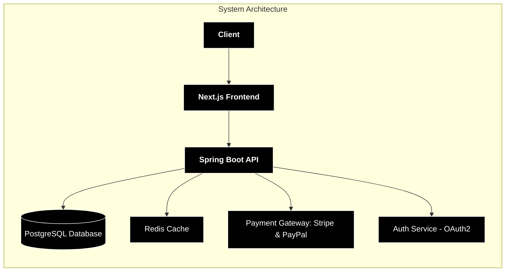
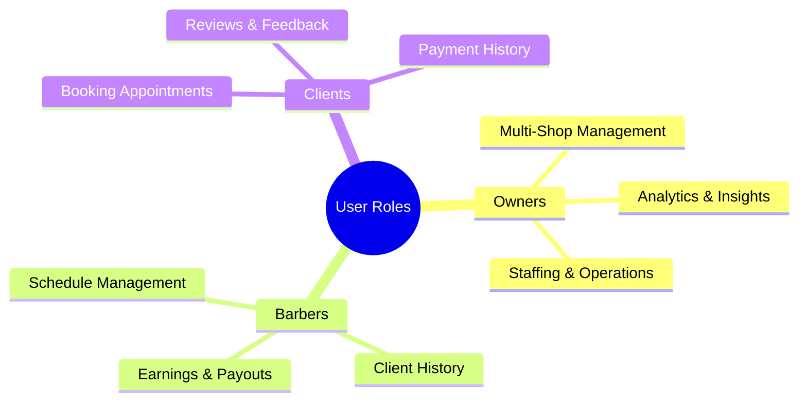

# BarberOS ✂️ - Modern Barbershop Management Platform

[](https://spring.io/) [](https://nextjs.org/) [](LICENSE) [](https://www.typescriptlang.org/) [](https://tailwindcss.com/) [](https://oauth.net/2/)


**Enterprise-ready solution** connecting barbers, clients, and shop owners through digital workflows.

---

## **Repository Overview**

```
.
├── backend/       # Spring Boot API (Authentication, Business Logic)
├── frontend/      # Next.js 15 Web App (UI & Client Interaction)
├── docs/          # Documentation, ADRs, Security Reports (private for now)
├── public/        # Static assets (images, icons, etc.)
```

### 📖 **Documentation & Reference**

📌 **[Backend Documentation](backend/README.md)**

- 48 REST endpoints
- 22 entity relationships
- 9 enum state machines

📌 **[Frontend Documentation](frontend/README.md)**

- 31 React components
- 8 Zustand stores
- 4 authentication workflows

---

### **Key Features**

| Role        | Capabilities                                                                                 |
| ----------- | -------------------------------------------------------------------------------------------- |
| **Owners**  | 🏢 Multi-shop management • 📊 Analytics & Reporting • 👥 Staffing Control • 💰 Staff earning |
| **Barbers** | 📅 Schedule management • 🗂 Client history • 💰 Earnings tracking                             |
| **Clients** | 🔖 Booking • ⭐ Reviews & Feedback • 💳 Payment history                                      |

#### 🏗 Architecture





---

## Citation & Attribution

```
@software{Barbershop,
  author = {Angel Jair Haro Jimenez},
  title = {Barbershop: Modern Barbershop Management Platform},
  year = {2025},
  url = {https://github.com/aharoj/barbershop}
}
```
