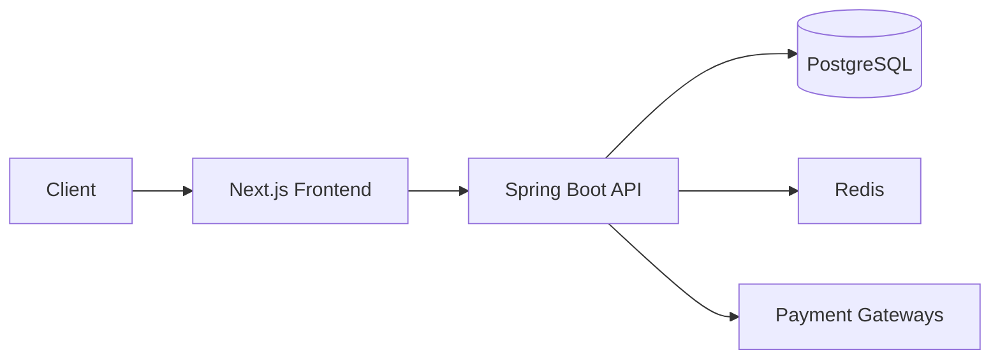
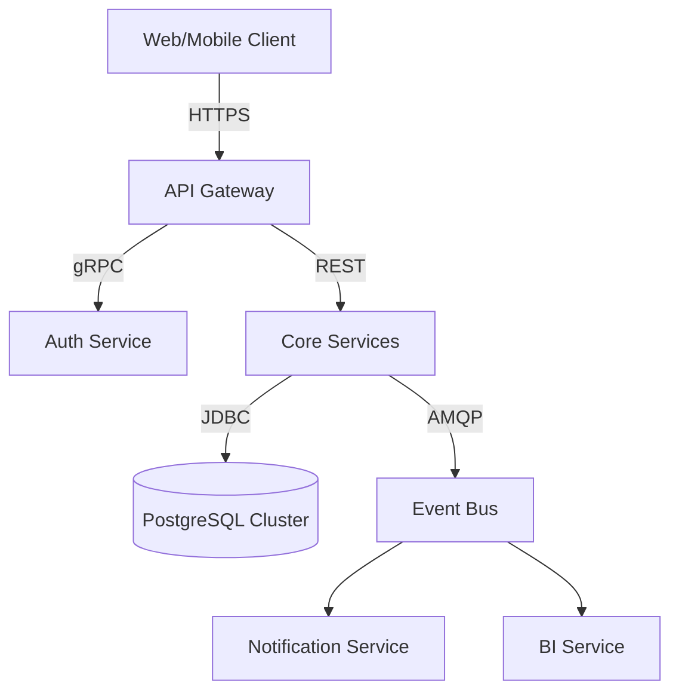

# BarberOS ✂️ - Modern Barbershop Management Platform

[](https://spring.io/) [](https://nextjs.org/) [](LICENSE) [](https://www.typescriptlang.org/) [](https://tailwindcss.com/) [](https://oauth.net/2/)


**Enterprise-ready solution** connecting barbers, clients, and shop owners through digital workflows.  
**Live Demo**: [demo.barberos.app](https://your-demo-link.com) | **Documentation**: [docs.barberos.app](https://your-docs-link.com)

---

## 🌟 Key Features

| Role        | Capabilities                                    |
| ----------- | ----------------------------------------------- |
| **Owners**  | Multi-shop management • Analytics • Staffing    |
| **Barbers** | Schedule management • Client history • Earnings |
| **Clients** | Booking • Reviews • Payment history             |

**Core Modules**:  
✅ Real-time seat allocation • 💳 Stripe/PayPal integration  
🔒 JWT+RSA security • 📈 Promotion engine • 📱 Mobile-first UI

---

## 🏗 Architecture



---

## 🚀 Get Started

1. **Backend Setup**  
   [Detailed backend instructions →](backend/README.md)

   ```bash
   cd backend && mvn spring-boot:run
   ```

2. **Frontend Setup**  
   [Detailed frontend instructions →](frontend/README.md)
   ```bash
   cd frontend && npm install && npm run dev
   ```

---

## 📂 Repository Structure

```
.
├── backend/       # Spring Boot API • PostgreSQL • Security
├── frontend/      # Next.js 15 • Tailwind • Zustand
└── public/        # Assets & screenshots
```

---

### **Frontend README.md** (copy-paste)

````markdown
# BarberOS Frontend 🖥️

**Next.js 15 • TypeScript • Tailwind CSS**

[](https://typescriptlang.org)  
[](https://zustand-demo.pmnd.rs/)

## 🌈 UI Features

- **Role-based Dashboards**  
  

- **Authentication Flows**
  ```tsx
  // Protected route example
  const { user } = useAuthStore();
  return user ? <Dashboard /> : <Login />;
  ```
````

## 🚦 Routing System

| Path                    | Component            |
| ----------------------- | -------------------- |
| `/owner/[id]/dashboard` | Shop analytics       |
| `/barber/[id]/schedule` | Appointment calendar |

## 🧱 Project Structure

```bash
src/
├── app/          # App router
├── stores/       # Zustand state
│   └── authStore.ts
└── modules/
    ├── auth/     # Auth services
    └── payment/  # Stripe integration
```

[🔼 Back to Main README](../README.md)

### [VISIT BACKEND](backend/)

Spring Boot API handling business logic, authentication, and data management

### [VISIT FRONTEND](frontend/)

Next.js web application implementing user workflows


[View Frontend Documentation](frontend/README.md)  
[View Backend Documentation](backend/README.md)  


---
---
---
---
---
---
---
---


# BarberOS Platform  
**Enterprise Barbershop Management System**  

[](LICENSE)  
[](.github/workflows)  
[](docs/)  

## Architectural Overview  

### System Topology  


## Key System Characteristics  

| Attribute               | Implementation Strategy                  | Verification Method         |  
|-------------------------|------------------------------------------|-----------------------------|  
| Availability            | 99.9% SLA via Kubernetes HPA            | Chaos Engineering Tests     |  
| Data Consistency        | Event Sourcing with CQRS                 | Jepsen Testing              |  
| Audit Compliance        | Immutable Request Logging                | SOC2 Audit Reports          |  
| Fault Tolerance         | Circuit Breakers (Resilience4j)          | Failure Injection Testing   |  

## Cross-Cutting Concerns  

### Security Model  
```text
RBAC → ABAC → ReBAC Hierarchy:  
Role-Based Access Control → Attribute-Based → Relationship-Based  
  ↓            ↓                  ↓  
User Roles   Resource Tags   Owner-Barber-Shop Relationships  
```

### Observability Stack  
| Component      | Toolchain                          | Sampling Rate |  
|----------------|------------------------------------|---------------|  
| Metrics        | Prometheus + Grafana               | 100%          |  
| Logging        | ELK Stack                          | 10%           |  
| Distributed Tracing | Jaeger                          | 5%            |  

## Development Ecosystem  

### Repository Structure  
```  
.  
├── backend/         # Core business logic implementation  
├── frontend/        # User interface components  
├── docs/            # Architectural decision records  
├── infrastructure/  # Terraform/IaC configurations  
└── contracts/       # OpenAPI/Protobuf specifications  
```  

## Quality Assurance  

### Verification Matrix  
| Test Type         | Scope              | Tools                  | Coverage Target |  
|-------------------|--------------------|------------------------|-----------------|  
| Contract Testing  | API Endpoints      | Pact                   | 100% endpoints  |  
| Property Testing  | Domain Logic       | jqwik (Java)/fast-check (TS) | 85% edge cases |  
| Load Testing      | Concurrent Users   | k6                     | 10k RPS         |  

## Getting Started  

```bash  
# Clone repository  
git clone https://github.com/yourorg/barberos.git  

# Initialize development environment  
make init-env  

# Follow component-specific guides:  
- Backend: See backend/README.md  
- Frontend: See frontend/README.md  
```  

## Documentation Hierarchy  
```  
docs/  
├── ARCHITECTURE.md     # System-wide design decisions  
├── DATA_MODEL.md       # Entity-relationship diagrams  
├── API_SPEC.md         # OpenAPI documentation  
└── OPERATIONS.md       # Deployment runbooks  
```  

## Citation & Attribution  
If using this architecture in academic work, cite as:  
```  
@software{BarberOS,  
  author = {Your Name},  
  title = {BarberOS: Modern Barbershop Management Platform},  
  year = {2024},  
  url = {https://github.com/yourorg/barberos}  
}  
```  

---  
*This documentation reflects the implemented system architecture as of commit [a1b2c3d].  
For implementation details, refer to component-specific documentation.*