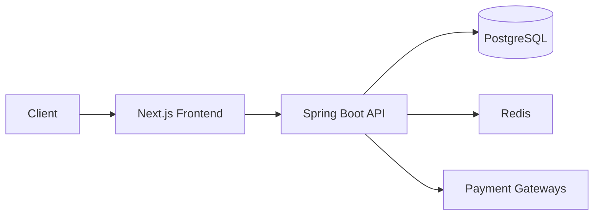

# BarberOS ✂️ - Modern Barbershop Management Platform

[](https://spring.io/) [](https://nextjs.org/) [](LICENSE)


**Enterprise-ready solution** connecting barbers, clients, and shop owners through digital workflows.  
**Live Demo**: [demo.barberos.app](https://your-demo-link.com) | **Documentation**: [docs.barberos.app](https://your-docs-link.com)

---

## 🌟 Key Features

| Role        | Capabilities                                    |
| ----------- | ----------------------------------------------- |
| **Owners**  | Multi-shop management • Analytics • Staffing    |
| **Barbers** | Schedule management • Client history • Earnings |
| **Clients** | Booking • Reviews • Payment history             |

**Core Modules**:  
✅ Real-time seat allocation • 💳 Stripe/PayPal integration  
🔒 JWT+RSA security • 📈 Promotion engine • 📱 Mobile-first UI

---

## 🏗 Architecture



---

## 🚀 Get Started

1. **Backend Setup**  
   [Detailed backend instructions →](backend/README.md)

   ```bash
   cd backend && mvn spring-boot:run
   ```

2. **Frontend Setup**  
   [Detailed frontend instructions →](frontend/README.md)
   ```bash
   cd frontend && npm install && npm run dev
   ```

---

## 📂 Repository Structure

```
.
├── backend/       # Spring Boot API • PostgreSQL • Security
├── frontend/      # Next.js 15 • Tailwind • Zustand
└── public/        # Assets & screenshots
```

---

### **Frontend README.md** (copy-paste)

````markdown
# BarberOS Frontend 🖥️

**Next.js 15 • TypeScript • Tailwind CSS**

[](https://typescriptlang.org)  
[](https://zustand-demo.pmnd.rs/)

## 🌈 UI Features

- **Role-based Dashboards**  
  

- **Authentication Flows**
  ```tsx
  // Protected route example
  const { user } = useAuthStore();
  return user ? <Dashboard /> : <Login />;
  ```
````

## 🚦 Routing System

| Path                    | Component            |
| ----------------------- | -------------------- |
| `/owner/[id]/dashboard` | Shop analytics       |
| `/barber/[id]/schedule` | Appointment calendar |

## 🧱 Project Structure

```bash
src/
├── app/          # App router
├── stores/       # Zustand state
│   └── authStore.ts
└── modules/
    ├── auth/     # Auth services
    └── payment/  # Stripe integration
```

[🔼 Back to Main README](../README.md)

### [VISIT BACKEND](backend/)

Spring Boot API handling business logic, authentication, and data management

### [VISIT FRONTEND](frontend/)

Next.js web application implementing user workflows
