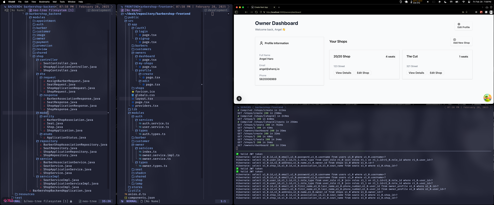

# BarberShop Platform ✂️
A full-stack platform connecting barbers, shop owners, and clients through modern digital solutions.

### [VISIT BACKEND](backend/)
Spring Boot API handling business logic, authentication, and data management

### [VISIT FRONTEND](frontend/)
Next.js web application implementing user workflows

## Tech Stack
**Frontend**:  
`Next.js 15` · `TypeScript` · `Tailwind CSS` · `Zustand`

**Backend**:  
`Spring Boot 3` · `Java 17` · `PostgreSQL` · `JWT` · `RSA` · `CORS`

**Tooling**:  
`Maven` · `Git` · `Postman` · `Npm` · `Pip` · `Nvim`