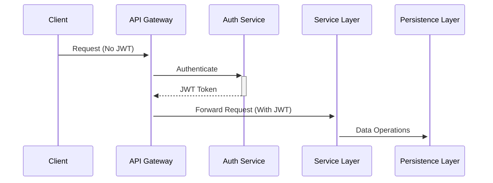
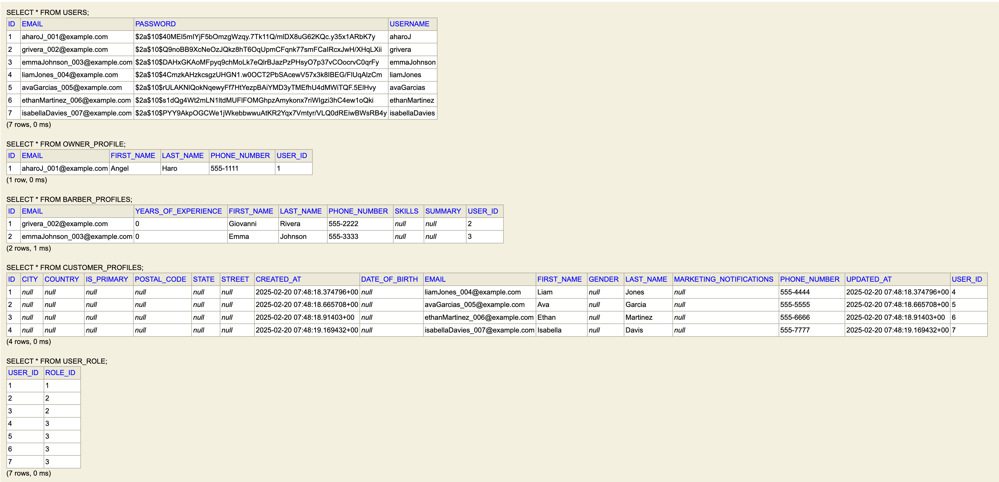

# BarberOS Backend System

**Enterprise-grade barbershop management API**  
_Spring Boot 3 | Java 17 | PostgreSQL | JWT/RSA Security_

[](https://spring.io/projects/spring-boot) [](https://spring.io/projects/spring-security) [](https://hibernate.org) [](https://www.postgresql.org/) [](https://jwt.io) [](https://openjdk.org) []() []()

## Architectural Overview

### Layered Architecture

```
Presentation Layer → Business Layer → Persistence Layer → Database
       ↑                   ↑                  ↑
    Controllers        Services         Repositories
```

### Security Architecture



## Core Components

### 1. Authentication System

- **JWT Implementation**: RSA-256 signed tokens with refresh token rotation
- **Security Chain**:
  1. JwtRequestFilter validates token structure
  2. UserDetailsService loads user authorities
  3. SecurityContextHolder establishes execution context
- **Password Encoding**: BCrypt with strength 12

### 2. Domain Model

| Entity            | Relationships           | Business Rules              |
| ----------------- | ----------------------- | --------------------------- |
| `Appointment`     | ManyToOne: User, Barber | Time slot validation        |
| `Payment`         | OneToOne: Appointment   | PCI-DSS compliance          |
| `ShopApplication` | ManyToOne: Barber, Shop | State transition validation |

### 3. API Design Principles

- **Resource Naming**:
  - `/api/{domain}/{resource}/{id}`
  - Example: `/api/shops/{shopId}/seats`
- **Response Standardization**:
  ```json
  {
    "timestamp": "2024-02-20T14:23:38Z",
    "status": 200,
    "data": {},
    "errors": []
  }
  ```

## Module Snippet

### Shop Management Module

```java
// Seat allocation algorithm
public Seat allocateSeat(SeatRequest request) {
    validateMaxOccupancy(request.getShopId());
    checkBarberAvailability(request.getBarberId());
    return seatRepository.save(new Seat(...));
}
```

### Authentication

- `POST /api/auth/signup` - User registration
- `POST /api/auth/login` - User login with JWT

### Profile Management

- **Barbers**: CRUD operations via `/api/barbers/me`
- **Customers**: CRUD operations via `/api/customers/me`
- **Owners**: CRUD operations via `/api/owners/me`

### Shop Management

- `GET /api/shops` - Public shop listing
- Owner endpoints for shop creation, seat management, and barber assignments

### Applications System

- Barber applications workflow with owner approval/rejection

## Image Samples

> function snippet


> Database sample



### Minimal Tree 

> Auth and Barber minimal sample

```bash
.
├── auth
│  ├── config
│  ├── controller
│  │  └── test
│  ├── dto
│  │  ├── request
│  │  └── response
│  ├── exception
│  ├── model
│  │  ├── entity
│  │  └── enums
│  ├── repository
│  ├── security        
├── barber
│  ├── controller
│  ├── dto
│  │  ├── request
│  │  └── response
│  ├── exception
│  ├── model
│  │  └── entity
│  ├── repository
│  ├── service
│  └── serviceImpl
```

### Database Schema Management

```sql
CREATE TABLE shops (
    id UUID PRIMARY KEY,
    name VARCHAR(255) NOT NULL,
    capacity INT CHECK (capacity > 0),
    CONSTRAINT unique_shop_name UNIQUE (name)
);
```

_Licensed under AGPL-3.0 - See [LICENSE](LICENSE) for details_  
_Architectural documentation maintained in `/docs/architecture`_

[View Frontend Documentation](../frontend/README.md)  
[Main Project Documentation](../README.md)
