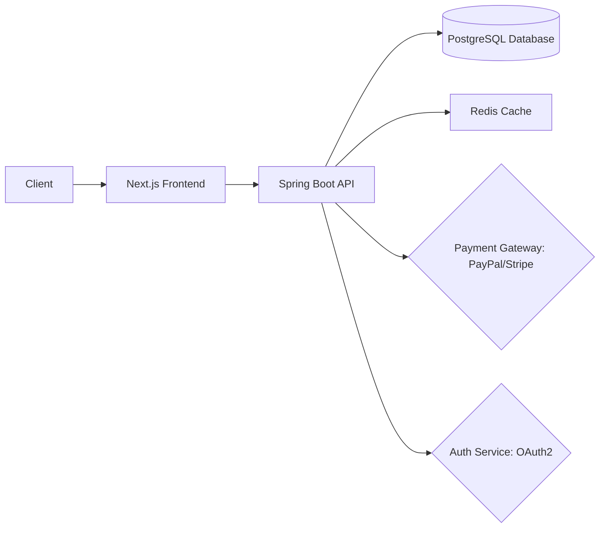
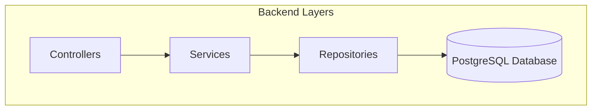
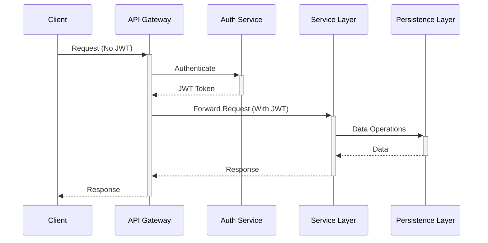
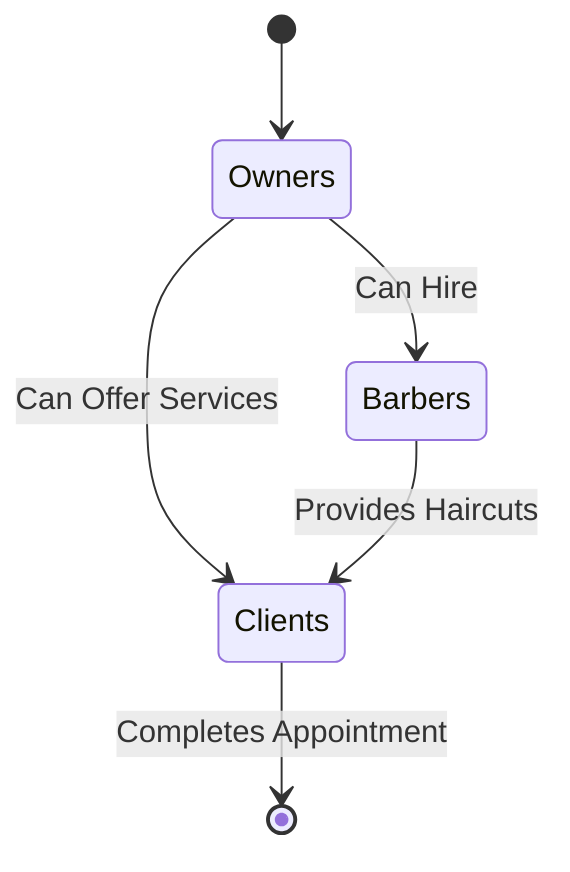
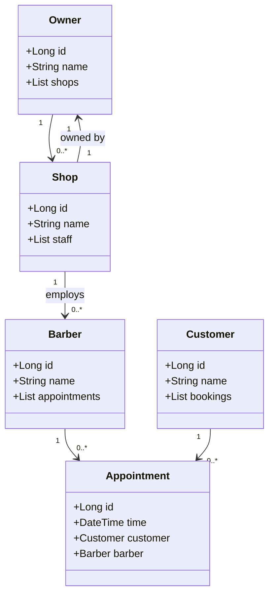

# BarberOS Backend System

**Enterprise-grade barbershop management API**  
_Spring Boot 3 | Java 17 | PostgreSQL | JWT/RSA Security_

[](https://spring.io/projects/spring-boot) [](https://spring.io/projects/spring-security) [](https://hibernate.org) [](https://www.postgresql.org/) [](https://jwt.io) [](https://openjdk.org) []() []()


## **Repository Overview**

```
.
├── backend/       # (CURRENTLY HERE)
├── frontend/      # Next.js 15 Web App (UI & Client Interaction)
├── docs/          # Documentation, ADRs, Security Reports (private for now)
├── public/        # Static assets (images, icons, etc.)
```

### 📖 **Documentation & Reference**

📌 **[Landing Documentation](../README.md)**

📌 **[Backend Documentation](../backend/README.md)**

- 48 REST endpoints
- 22 entity relationships
- 9 enum state machines

📌 **[Frontend Documentation](../frontend/README.md)**

- 31 React components
- 8 Zustand stores
- 4 authentication workflows


## **Backend Architecture Overview**



- **Spring Boot-based API** for business logic & authentication.
- **Microservice-ready architecture** (considering Spring Cloud evolution).
- **Optimized for security, performance, and scalability.**

---

### **🏗 Layered Architecture**



- **Controller Layer:** Handles HTTP requests and routes.
- **Service Layer:** Business logic and transaction handling.
- **Repository Layer:** Persistence layer using Spring Data JPA.

---

### **Security Architecture**



- **JWT Authentication** (RSA-512 signed tokens with refresh rotation).
- **OAuth2 support** for third-party authentication (Google, GitHub).
- **Role-based access control (RBAC → ABAC → ReBAC).**

---

### Simplified Owner



## **Backend Structure**

```
backend/
├── src/main/java/io/aharoj/barbershop_backend/
│   ├── auth/          # JWT, OAuth2, Security Filters & Configuration
│   ├── appointment/   # Appointment scheduling logic
│   ├── barber/        # Barber profiles and management
│   ├── customer/      # Client data management
│   ├── shop/          # Shop management, owners included
│   ├── image/         # Image upload, barber & shop branding
│   ├── promotion/     # Discounts, coupons, promotional features
│   ├── common/        # Shared utilities, exception handling, validation
│   └── payment/       # Payment integrations (Stripe, PayPal)
└── src/test/          # Comprehensive unit & integration tests
```

---

## **Key Backend Features**

| **Feature**      | **Description**                                  |
| ---------------- | ------------------------------------------------ |
| **JWT Auth**     | Secure login, refresh tokens, OAuth2 integration |
| **RBAC & ReBAC** | Role & relationship-based access control         |
| **Scheduling**   | Barber-client appointment booking system         |
| **Payments**     | Secure transactions via Stripe & PayPal          |
| **Reviews**      | Customers can rate and review barbers            |
| **Shop System**  | Multi-shop support for owners                    |
| **Image Upload** | Profile images, barber portfolio, shop branding  |

---

## **Authentication & Security**

- JWT-based authentication (RSA-512 signed tokens, 30m access / 7d refresh)
- OAuth2 third-party integration (Google, GitHub)
- Role-based access control (RBAC)
- Planned key rotation automation (currently manual)

### **JWT Implementation (RSA-512)**

```java
// auth/security/JwtTokenUtil.java
public String generateToken(UserDetails userDetails) {
    return Jwts.builder()
         .signWith(privateKey, RS512)
         .compact();
}
```

- **Token lifetime:** 30m access / 7d refresh
- **Key rotation:** Manual (future automation planned)

---

## **RESTful API Design**

- Consistent, versioned, and resource-oriented API structure.
- Follows best practices for RESTful design.

### **Authentication Endpoints**

| Method | Endpoint            | Description            |
| ------ | ------------------- | ---------------------- |
| `POST` | `/api/auth/signup`  | User registration      |
| `POST` | `/api/auth/login`   | User login (JWT-based) |
| `POST` | `/api/auth/refresh` | Refresh JWT token      |

### **Barber & Client Management**

| Method | Endpoint              | Description           |
| ------ | --------------------- | --------------------- |
| `GET`  | `/api/barbers/{id}`   | Get barber profile    |
| `GET`  | `/api/customers/{id}` | Get client profile    |
| `PUT`  | `/api/barbers/me`     | Update barber profile |

### **Shop & Appointment System**

| Method | Endpoint                 | Description                  |
| ------ | ------------------------ | ---------------------------- |
| `GET`  | `/api/shops`             | Public shop listing          |
| `POST` | `/api/appointments`      | Create an appointment        |
| `GET`  | `/api/appointments/{id}` | Retrieve appointment details |

---

## **Domain Model (ERD)**



---

## **Image Samples**


---

## **License & Contribution**

**Licensed under AGPL-3.0** – See [LICENSE](LICENSE).

## End
[View Backend Documentation](../backend/README.md)  
[View Backend Documentation](../frontend/README.md)  
[Main Project Documentation](../README.md)