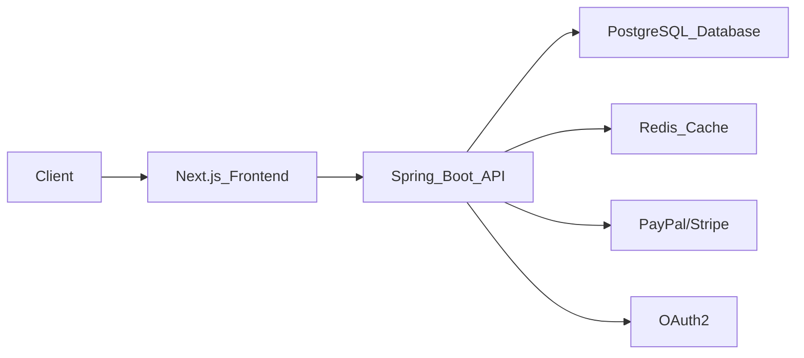
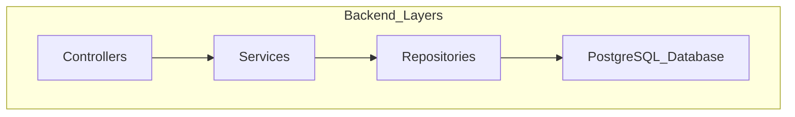
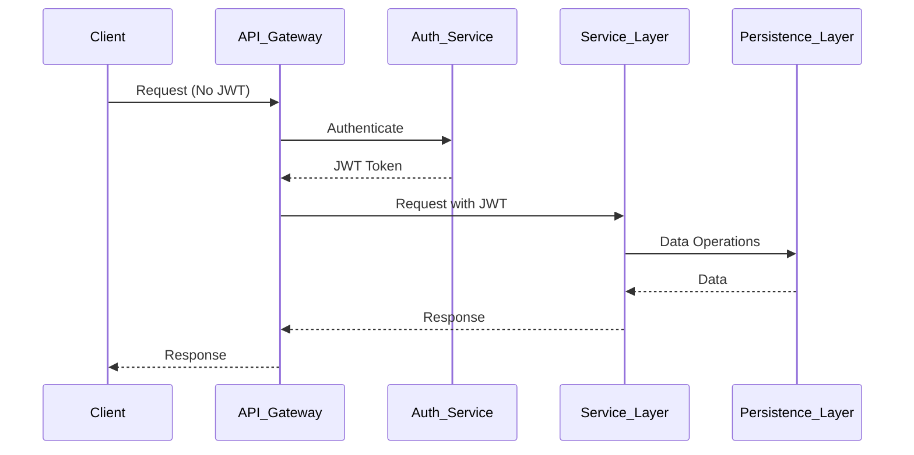

# Barbershop Backend System

**Enterprise-grade barbershop management API**  
_Spring Boot 3 | Java 17 | PostgreSQL | JWT/RSA Security_

[](https://spring.io/projects/spring-boot) [](https://spring.io/projects/spring-security) [](https://hibernate.org) [](https://www.postgresql.org/) [](https://jwt.io) [](https://openjdk.org) []() []()


---

## 📖 Table of Contents

- [Introduction](#introduction)
- [Repository Overview](#repository-overview)
- [Documentation & Reference](#documentation--reference)
- [Backend Architecture Overview](#backend-architecture-overview)
  - [High-Level Architecture](#high-level-architecture)
  - [Layered Architecture](#layered-architecture)
  - [Security Architecture](#security-architecture)
- [Backend Structure](#backend-structure)
- [Key Backend Features](#key-backend-features)
- [RESTful API Design](#restful-api-design)
  - [Authentication Endpoints](#authentication-endpoints)
  - [Barber & Client Management](#barber--client-management)
  - [Shop & Appointment System](#shop--appointment-system)
- [Image Samples](#image-samples)
- [License & Contribution](#license--contribution)

---

## Introduction

The BarberOS backend provides a secure, scalable, and high-performance solution for managing barbershop operations including appointments, payments, and customer management, built using modern technologies and standards.

---

## Repository Overview

```
.
├── backend/       # (CURRENTLY HERE)
├── frontend/      # Next.js 15 Web App (UI & Client Interaction)
├── docs/          # Documentation, ADRs, Security Reports (private for now)
├── public/        # Static assets (images, icons, etc.)
```

---

## 📚 Documentation & Reference

- 📌 **[Landing Documentation](../README.md)**
- 📌 **Backend Documentation (Currently Viewing)**
  - 48 REST endpoints
  - 22 entity relationships
  - 9 enum state machines
- 📌 **[Frontend Documentation](../frontend/README.md)**
  - 31 React components
  - 8 Zustand stores
  - 4 authentication workflows

---

## Backend Architecture Overview

### High-Level Architecture



### Layered Architecture



- **Controllers**: Handle HTTP requests and routing
- **Services**: Business logic and transactions
- **Repositories**: Data persistence using Spring Data JPA

### Security Architecture



- JWT Authentication (RSA-512)
- OAuth2 Third-party Auth Integration
- Role-based and Relationship-based Access Control (RBAC & ReBAC)

---

## Backend Structure

```
backend/
├── src/main/java/io/aharoj/comany_name/
│   ├── auth/          # JWT, OAuth2, Security Filters & Configuration
│   ├── appointment/   # Appointment scheduling logic
│   ├── barber/        # Barber profiles and management
│   ├── customer/      # Client data management
│   ├── shop/          # Shop management, owners included
│   ├── image/         # Image upload, barber & shop branding
│   ├── promotion/     # Discounts, coupons, promotional features
│   ├── common/        # Shared utilities, exception handling, validation
│   └── payment/       # Payment integrations (Stripe, PayPal)
└── src/test/          # Unit & integration tests
```

---

## Key Backend Features

| Feature      | Description                                     |
| ------------ | ----------------------------------------------- |
| JWT Auth     | Secure logins, OAuth2, refresh tokens           |
| RBAC & ReBAC | Role and relationship-based permissions         |
| Scheduling   | Barber-client appointment management            |
| Payments     | Secure payment processing (Stripe, PayPal)      |
| Reviews      | Customer reviews and ratings                    |
| Multi-Shop   | Support for multiple barbershop locations       |
| Image Upload | Upload barber profiles and shop branding assets |

---

## 🌐 RESTful API Design

### Authentication Endpoints

| Method | Endpoint            | Description            |
| ------ | ------------------- | ---------------------- |
| `POST` | `/api/auth/signup`  | User registration      |
| `POST` | `/api/auth/login`   | User login (JWT-based) |
| `POST` | `/api/auth/refresh` | Refresh JWT token      |

### **Barber & Client Management**

| Method | Endpoint              | Description        |
| ------ | --------------------- | ------------------ |
| `GET`  | `/api/barbers/{id}`   | Get barber profile |
| `GET`  | `/api/customers/{id}` | Get client profile |

### **Shop System**

| Method | Endpoint     | Description         |
| ------ | ------------ | ------------------- |
| `GET`  | `/api/shops` | Public shop listing |

### **Appointment System**

| Method | Endpoint            | Description     |
| ------ | ------------------- | --------------- |
| `GET`  | `/api/appointments` | Get appointment |

---

## Image Samples


---

## License & Contribution

Licensed under AGPL-3.0 – See [LICENSE](LICENSE).

---

### [Frontend Documentation](../frontend/README.md)

### [Landing Documentation](../README.md)
