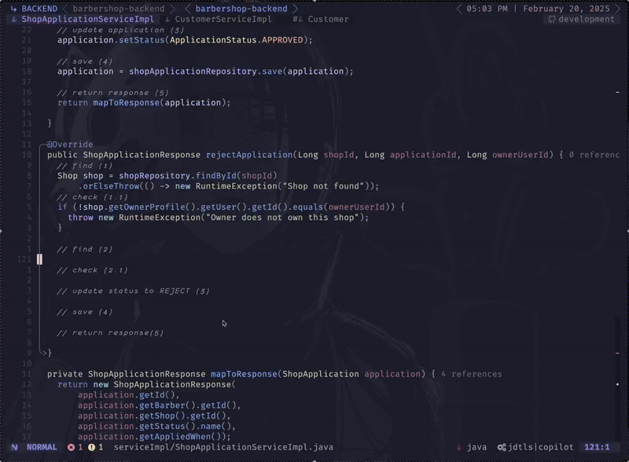

# BarberShop Backend API

REST API for managing barbershop operations, built with Java Spring Boot.

## Features

### Authentication
- `POST /api/auth/signup` - User registration
- `POST /api/auth/login` - User login with JWT

### Profile Management
- **Barbers**: CRUD operations via `/api/barbers/me`
- **Customers**: CRUD operations via `/api/customers/me` 
- **Owners**: CRUD operations via `/api/owners/me`

### Shop Management
- `GET /api/shops` - Public shop listing
- Owner endpoints for shop creation, seat management, and barber assignments

### Applications System
- Barber applications workflow with owner approval/rejection

## Image Samples 

> function snippet



> Database sample


### Project Structure

> Auth and Barber minimal sample 

```bash
.
├── auth
│  ├── config
│  ├── controller
│  │  └── test
│  ├── dto
│  │  ├── request
│  │  └── response
│  ├── exception
│  ├── model
│  │  ├── entity
│  │  └── enums
│  ├── repository
│  ├── security
├── barber
│  ├── controller
│  ├── dto
│  │  ├── request
│  │  └── response
│  ├── exception
│  ├── model
│  │  └── entity
│  ├── repository
│  ├── service
│  └── serviceImpl
```