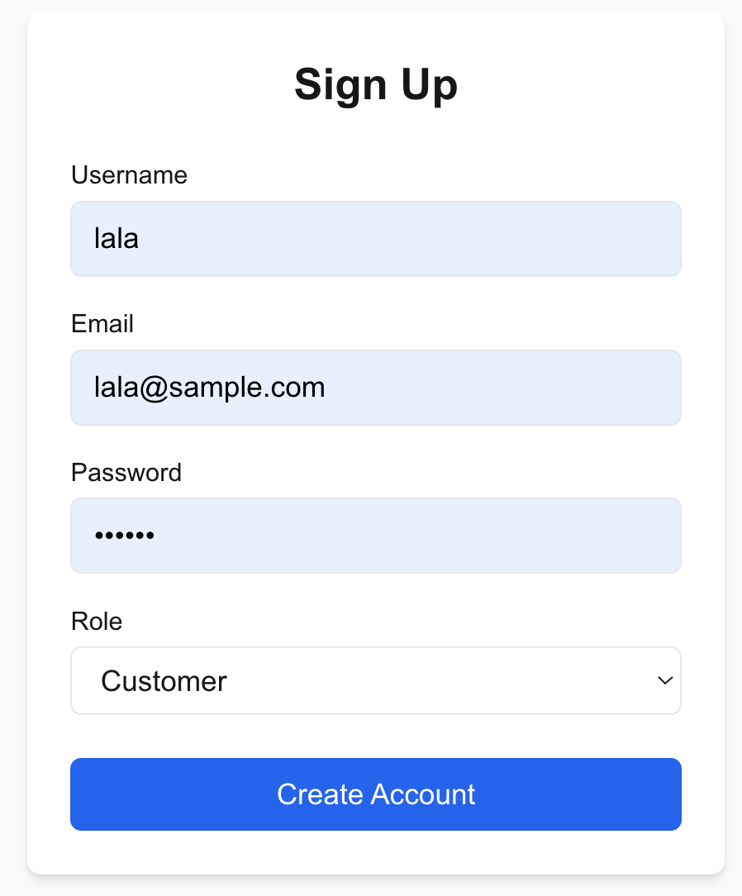
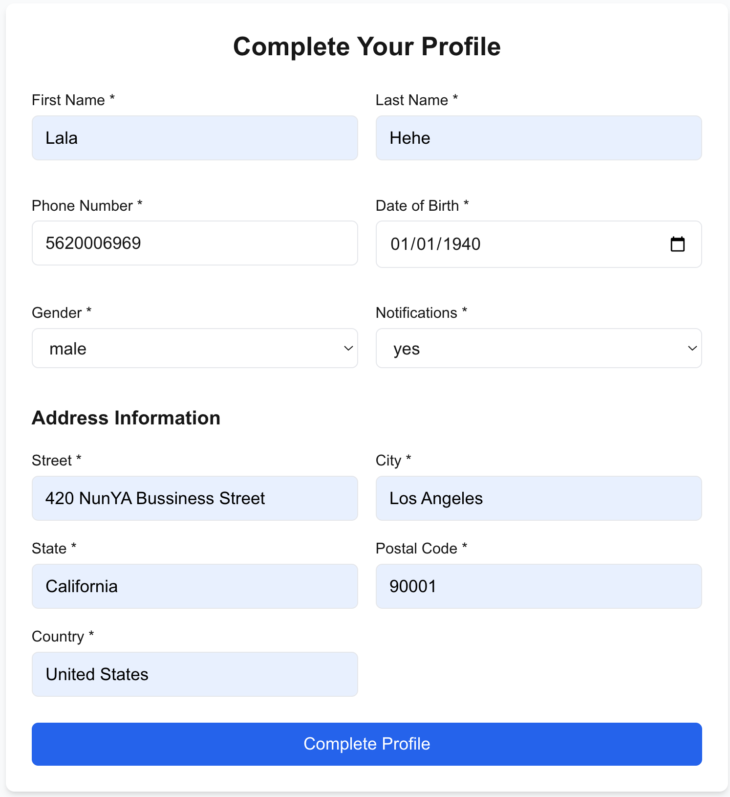
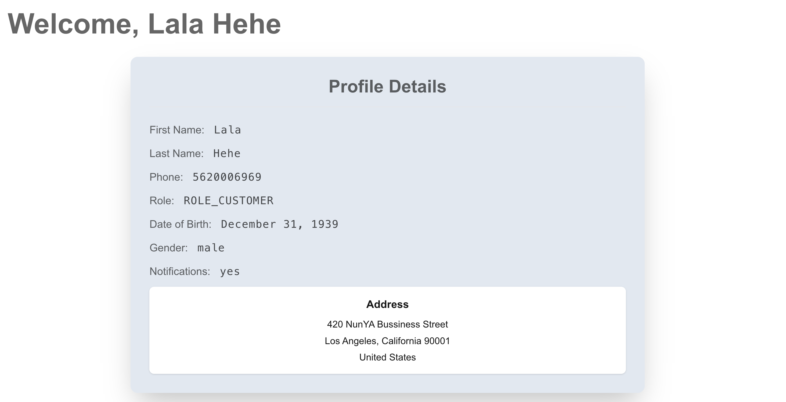

# BarberShop Frontend

Next.js web application for barbershop management.

## Features
- Authentication flows (Login/Signup)
- Profile management for:
  - Barbers
  - Customers
  - Shop Owners
- Shop browsing and management interface
- Protected routes using JWT

## UI Sample 

> Sign up



> Complete your Profile



> Dynamic routing {id}/dashboard




## Project Structure

```bash
src/
├── app/ - Next.js page routes
├── modules/ - Feature modules
│   ├── auth/ - Authentication services
│   ├── barber/ - Barber-related logic
├── stores/ - Zustand state management
└── utils/ - Shared utilities
```
