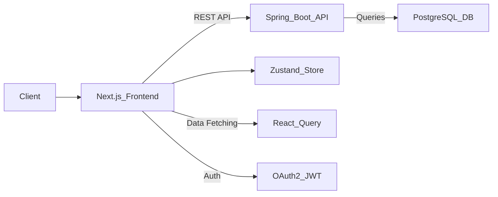
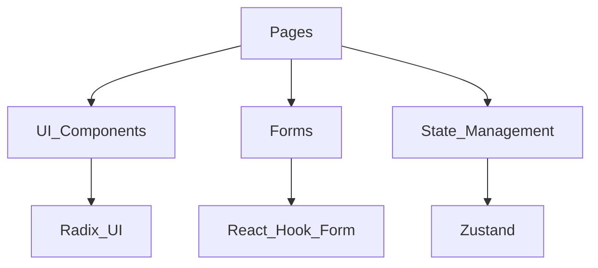
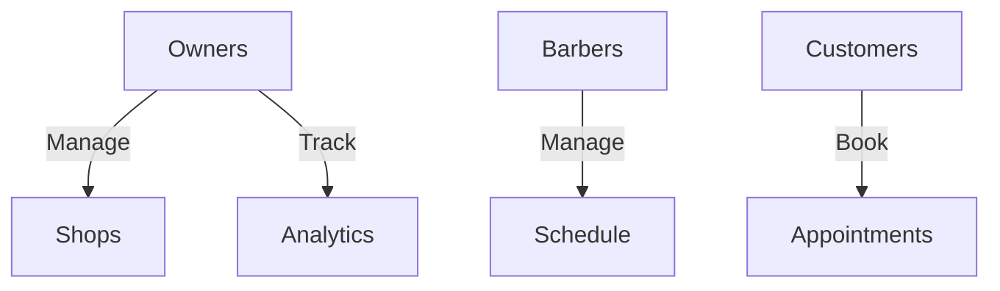
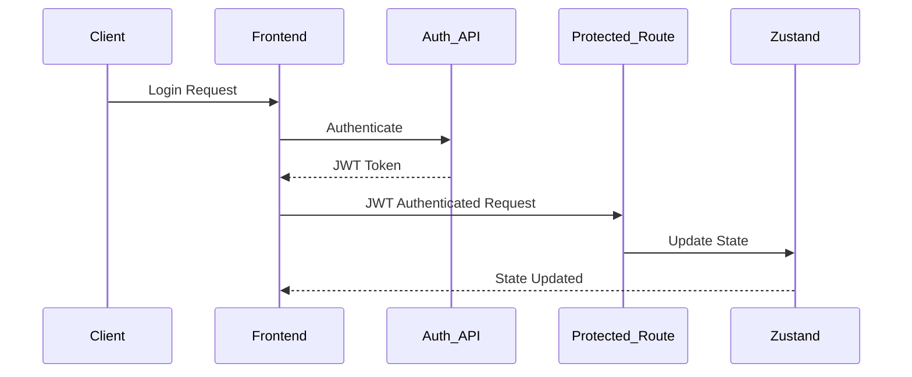
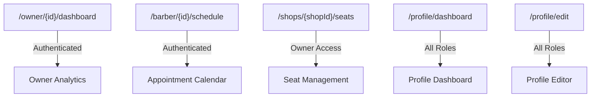

# Barbershop Frontend

[](https://nextjs.org/) [](https://react.dev) [](https://www.typescriptlang.org/) [](https://tailwindcss.com) [](https://zustand-demo.pmnd.rs/) [](https://tanstack.com/query) [](https://www.framer.com/motion/) [](https://www.radix-ui.com/) [](https://react-hook-form.com/) [](https://turbo.build/pack) [](https://eslint.org)

A **modern web interface** for managing barbershop operations, built with **Next.js 15** and optimized for **performance, scalability, and developer experience**.


---

## 📖 Table of Contents

- [Introduction](#introduction)
- [Repository Overview](#repository-overview)
- [Documentation & Reference](#documentation--reference)
- [Frontend Architecture Overview](#frontend-architecture-overview)
  - [High-Level Architecture](#high-level-architecture)
  - [Component Architecture](#component-architecture)
  - [Role-Based Access Control](#role-based-access-control)
  - [Authentication Flow](#authentication-flow)
- [Project Structure](#project-structure)
- [Routing Structure](#routing-structure)
- [License & Contribution](#license--contribution)

---

## Introduction

The Barbershop Frontend is a performant, scalable, and developer-friendly web application built with Next.js and modern technologies, designed to simplify and optimize barbershop operations.

---

## Repository Overview

```
.
├── backend/       # Spring Boot API (Authentication, Business Logic)
├── frontend/      # (CURRENTLY HERE)
├── docs/          # Documentation, ADRs, Security Reports (private)
├── public/        # Static assets (images, icons, etc.)
```

---

## 📚 Documentation & Reference

- 📌 **[Landing Documentation](../README.md)**
- 📌 **[Backend Documentation](../backend/README.md)**
  - 48 REST endpoints
  - 22 entity relationships
  - 9 enum state machines
- 📌 **Frontend Documentation (Currently Viewing)**
  - 31 React components
  - 8 Zustand stores
  - 4 authentication workflows

---

## Frontend Architecture Overview

### High-Level Architecture



- **Next.js App Router**: Handles SSR and dynamic routing.
- **State Management (Zustand)**: Simplified global state management.
- **Data Fetching (TanStack Query)**: Efficient data handling and caching.
- **JWT/OAuth2 Authentication**: Secure user authentication and sessions.

### Component Architecture



- **Pages**: Core navigational routes and entry points.
- **Components**: Built with Radix UI primitives and Tailwind CSS.
- **Forms**: Managed with React Hook Form and validated via Zod.
- **State Management**: Zustand stores manage global app states.

### Role-Based Access Control



| Role      | Capabilities                               |
| --------- | ------------------------------------------ |
| Owners    | Multi-shop management, staffing, analytics |
| Barbers   | Scheduling, client management              |
| Customers | Appointment booking, payment overview      |

### Authentication Flow



---

## Project Structure

```
src/
├── app/            # Next.js routes
│   ├── (auth)/     # Authentication routes
│   ├── barbers/    # Barber-specific pages
│   ├── owners/     # Owner dashboards
│   └── shops/      # Shop management
├── modules/        # Feature-specific logic
├── stores/         # Zustand global stores
├── lib/            # Shared utilities
└── types/          # TypeScript interfaces
```

---

## Routing Structure



| Route                   | Component         | Access Role |
| ----------------------- | ----------------- | ----------- |
| `/owner/[id]/dashboard` | Owner Dashboard   | Owners      |
| `/barber/[id]/schedule` | Schedule Calendar | Barbers     |
| `/shops/[shopId]/seats` | Seat Management   | Owners      |
| `/profile/dashboard`    | User Dashboard    | All Users   |
| `/profile/edit`         | Profile Editor    | All Users   |

---

## License & Contribution

Licensed under AGPL-3.0 – See [LICENSE](LICENSE).

---

### [Backend Documentation](../backend/README.md)

### [Landing Documentation](../README.md)
