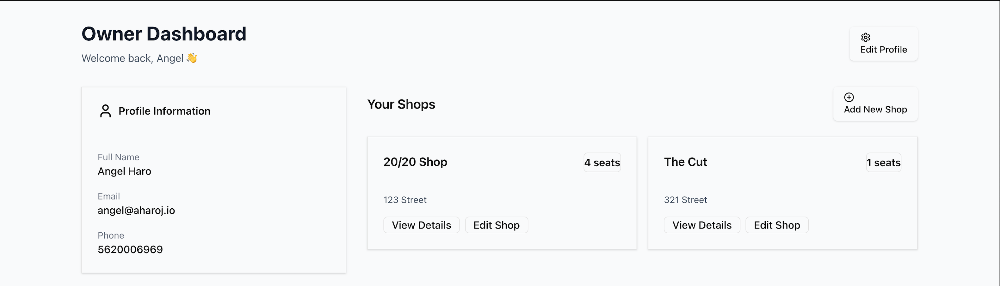
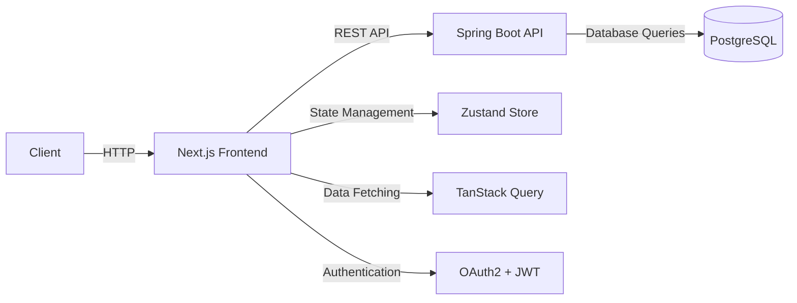
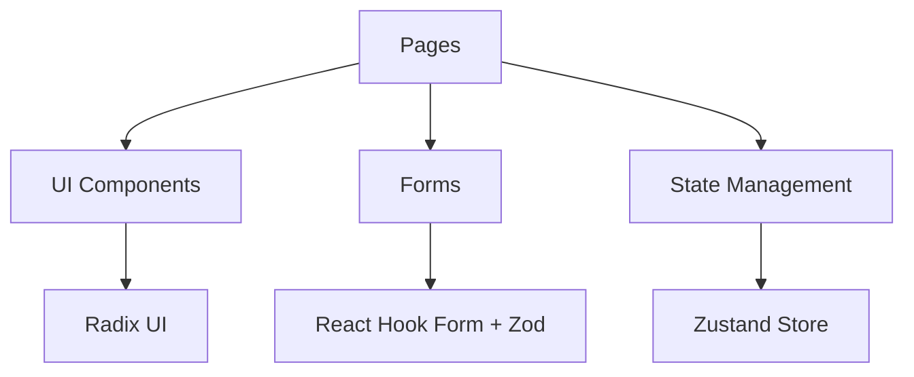
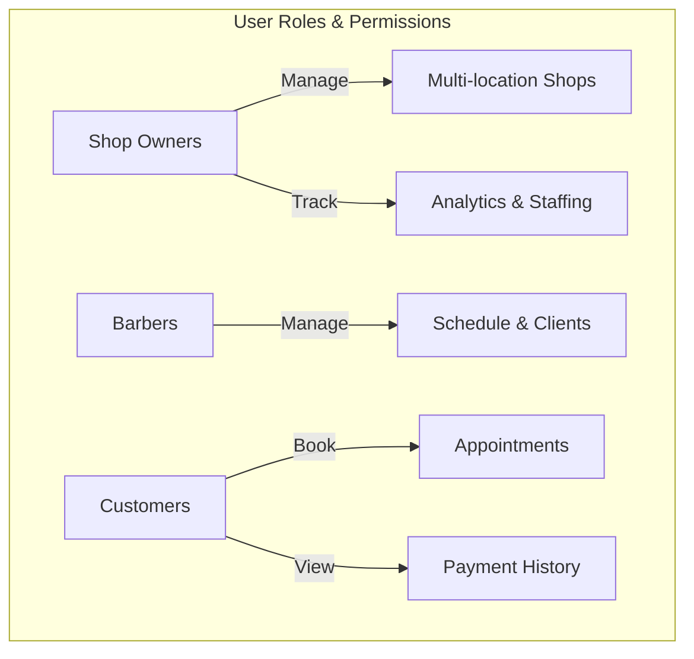
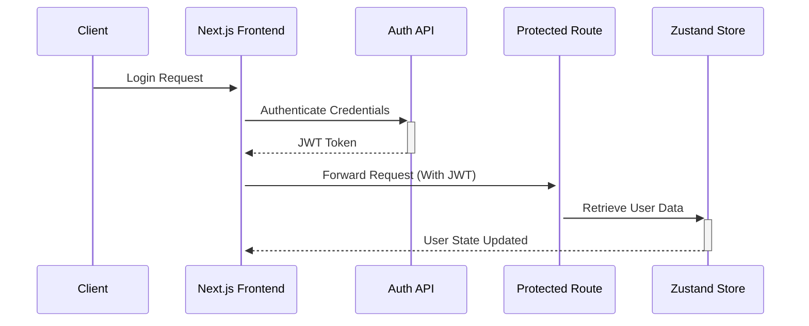
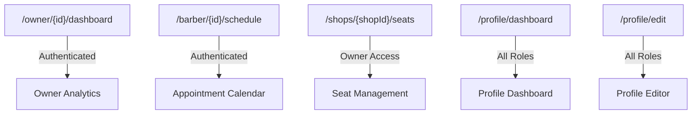

# BarberOS Frontend

[](https://nextjs.org/) [](https://react.dev) [](https://www.typescriptlang.org/) [](https://tailwindcss.com) [](https://zustand-demo.pmnd.rs/) [](https://tanstack.com/query) [](https://www.framer.com/motion/) [](https://www.radix-ui.com/) [](https://react-hook-form.com/) [](https://turbo.build/pack) [](https://eslint.org)


A **modern web interface** for managing barbershop operations, built with **Next.js 15** and optimized for **performance, scalability, and developer experience**.  




## **Repository Overview**

```
.
├── backend/       # Spring Boot API (Authentication, Business Logic)
├── frontend/      # Next.js 15 Web App (UI & Client Interaction)
├── docs/          # Documentation, ADRs, Security Reports (private for now)
├── public/        # Static assets (images, icons, etc.)
```

### 📖 **Documentation & Reference**

📌 **[Backend Documentation](backend/README.md)**

- 48 REST endpoints
- 22 entity relationships
- 9 enum state machines

📌 **[Frontend Documentation](frontend/README.md)**

- 31 React components
- 8 Zustand stores
- 4 authentication workflows


## **Frontend Architecture Overview**  



- **Next.js App Router** powers the client-side rendering and SSR.  
- **State management via Zustand** for global store handling.  
- **React Query handles data fetching**, caching, and synchronization.  
- **Secure authentication** with JWT tokens and OAuth2 integration.  

---

## **🏗 Component Architecture**  



- **Pages:** Core Next.js page routes.  
- **UI Components:** Built using Radix UI primitives and Tailwind CSS.  
- **Forms:** Managed with React Hook Form and validated with Zod.  
- **State Management:** Centralized logic in Zustand stores.  

---

## **Project Structure**  

```
src/
├── app/            # Next.js page routes
│   ├── (auth)      # Authentication routes
│   ├── barbers/    # Barber-specific views
│   ├── owners/     # Owner management
│   └── shops/      # Shop operations
├── modules/        # Feature modules
│   ├── auth/       # Authentication services
│   ├── barber/     # Barber management
│   └── shop/       # Shop operations
├── stores/         # Zustand state stores
├── lib/            # Shared utilities
└── types/          # TypeScript definitions
```

- **Feature Modules:** Encapsulate functionality for authentication, barbers, and shops.  
- **Zustand Stores:** Handle global application state.  
- **Shared Utilities:** Common functions for API calls and error handling.  

---

## **Role-Based Access Control**  



| **Role**      | **Capabilities**                           |
|--------------|------------------------------------------|
| **Owners**   | Multi-location management, analytics, staffing |
| **Barbers**  | Schedule management, client history     |
| **Customers**| Appointment booking, payment history    |

- **Owners** oversee **multiple shops** and handle **staffing**.  
- **Barbers** manage **client appointments and personal earnings**.  
- **Customers** book services and **view their payment history**.  

---

## **Authentication Flow**  



- **Login Flow:** Users authenticate via the Next.js frontend, which requests a **JWT token** from the backend.  
- **State Management:** The JWT token is stored in **Zustand**, and **React Query synchronizes** user sessions.  
- **Protected Routes:** Pages enforce **role-based access control (RBAC)**.  

---

## **Routing Structure**  



| **Route Pattern**       | **Component**           | **Access Level**  |
|------------------------|-----------------------|------------------|
| `/owner/[id]/dashboard` | Owner Analytics       | Authenticated    |
| `/barber/[id]/schedule` | Appointment Calendar  | Barber Role      |
| `/shops/[shopId]/seats` | Seat Management       | Shop Owner       |
| `/profile/dashboard`    | Profile Dashboard     | All Roles        |
| `/profile/edit`         | Profile Editor        | All Roles        |


## **License & Contribution**  

- **Licensed under AGPL-3.0** – See [LICENSE](LICENSE).  
- **Contributions Welcome** – Check [CONTRIBUTING.md](docs/CONTRIBUTING.md).  


## End
[View Backend Documentation](../backend/README.md)  
[View Backend Documentation](../frontend/README.md)  
[Main Project Documentation](../README.md)
